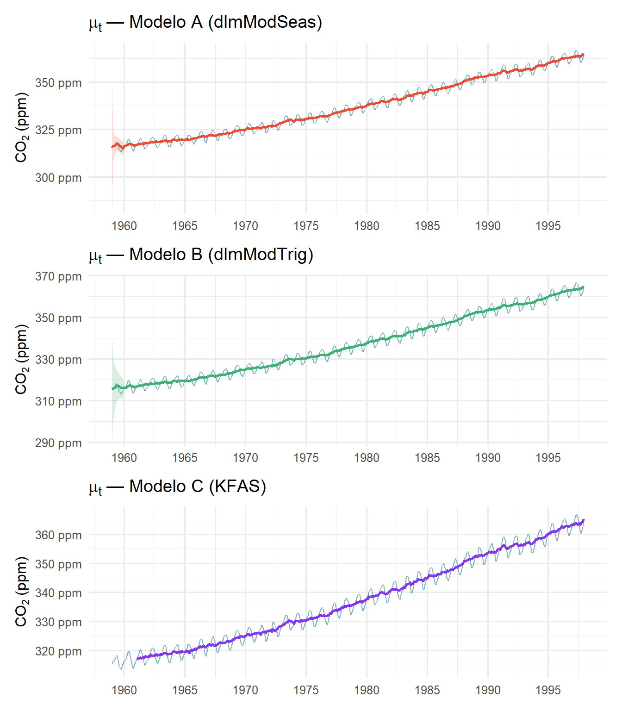
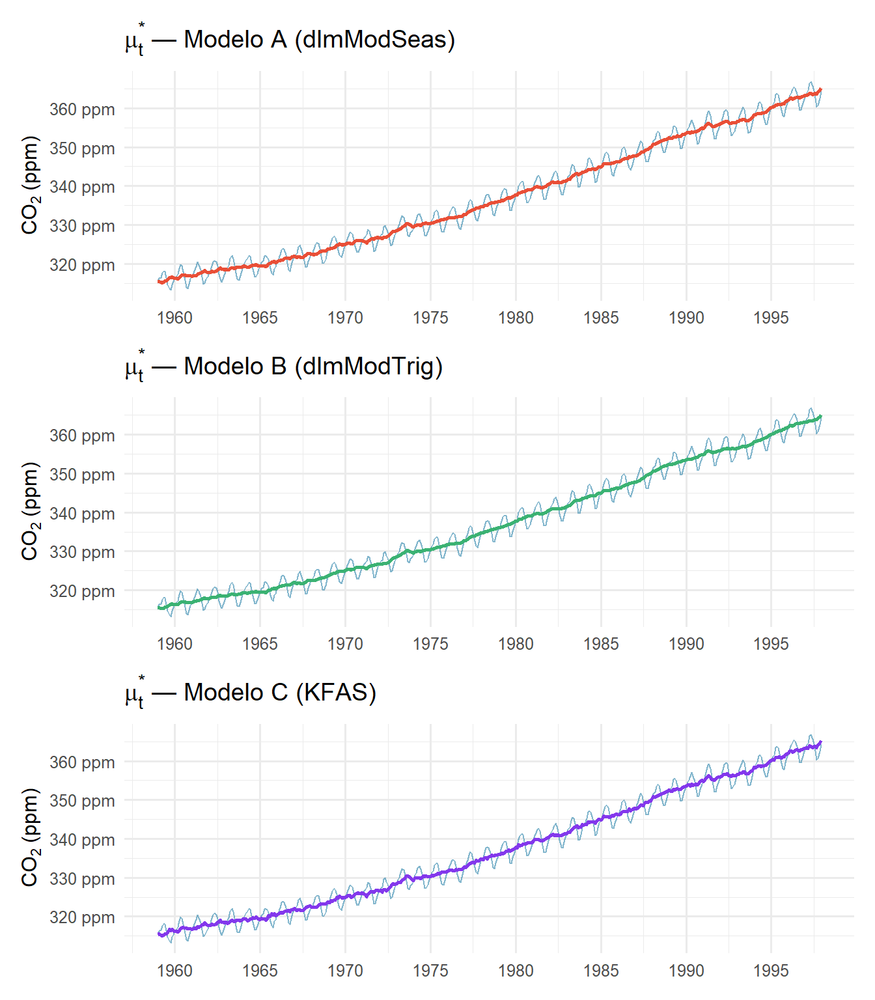
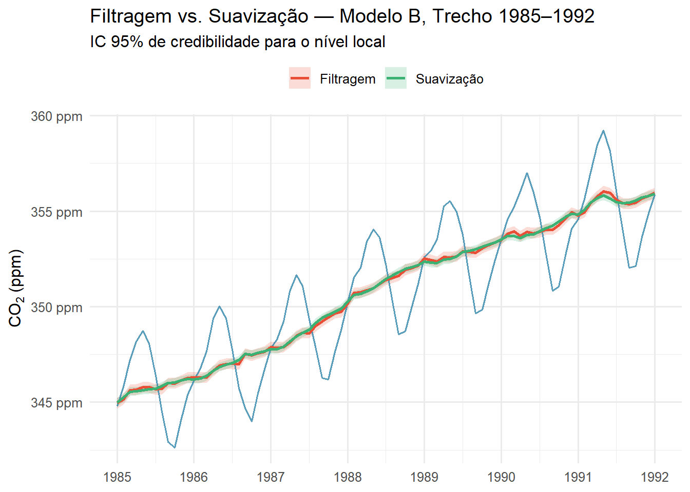
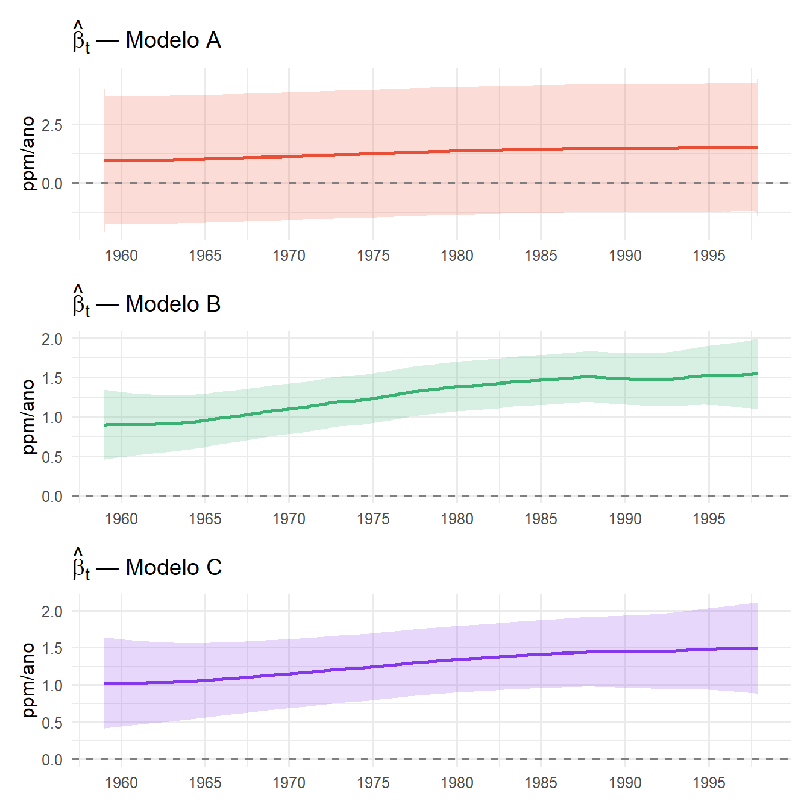
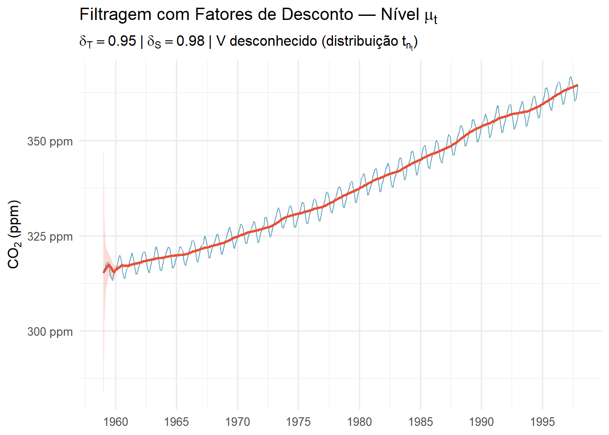
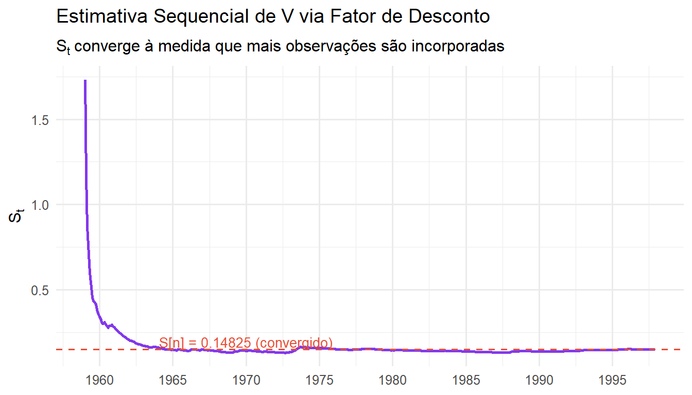
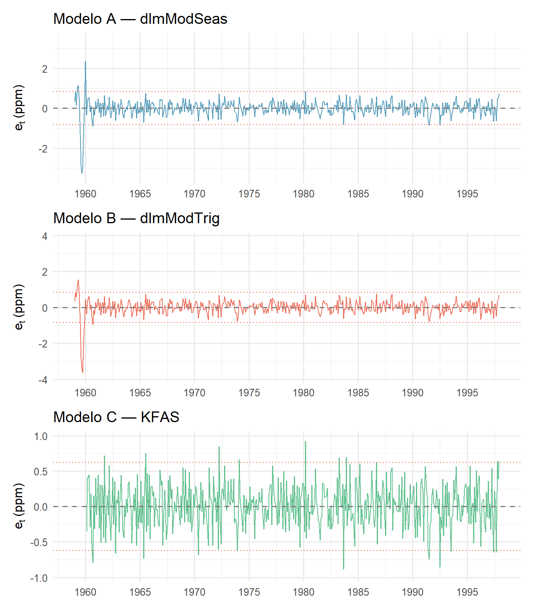
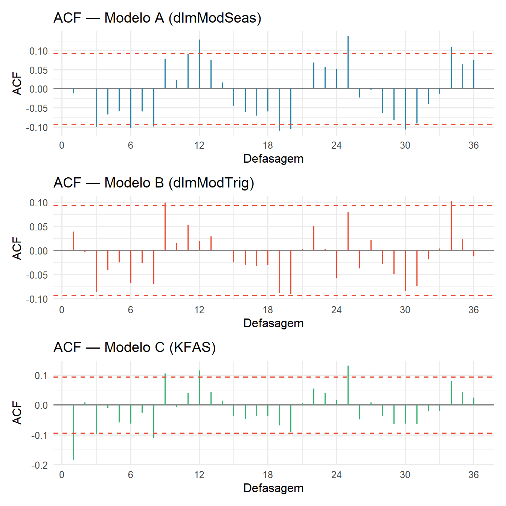
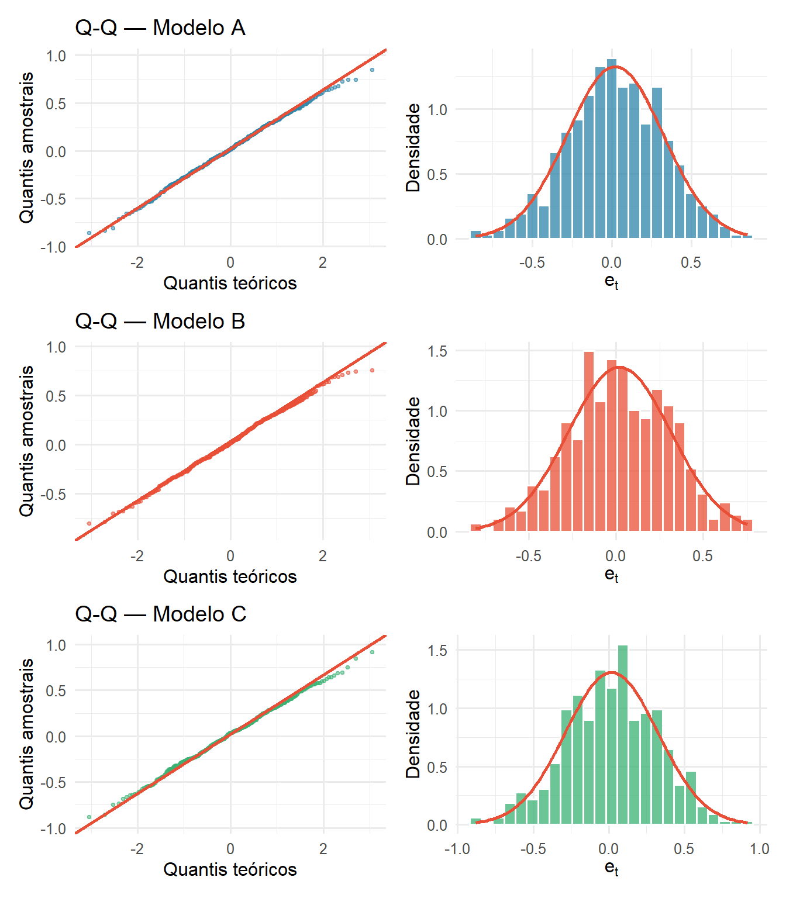

# CO₂ Atmosférico em Mauna Loa — Modelos Lineares Dinâmicos

**Análise de Séries Temporais — Trabalho 2 (2026/1)**  
DME / Instituto de Matemática — UFRJ

> **Autores:** Arthur Pontes Motta e Catarine Martins  
> **Professor:** João Batista de Morais Pereira

---

## Relatório

[](https://arthurpmotta02.github.io/co2-mauna-loa-dlm/)

O relatório está disponível em formato interativo:

- **[Versão interativa](https://arthurpmotta02.github.io/co2-mauna-loa-dlm/)** — gráficos com código R expansível, tabelas completas e resultados inline (GitHub Pages)

> A análise descritiva completa da série (decomposição STL, padrão sazonal, taxa de crescimento) encontra-se no **[Trabalho 1 — SARIMA](https://arthurpmotta02.github.io/co2-mauna-loa-sarima/)** e não é repetida aqui.

---

## Sobre o trabalho

Aplicação da metodologia de **Modelos Lineares Dinâmicos (MLD)** à série `co2` (disponível nativamente no R), contendo as concentrações médias mensais de CO₂ atmosférico medidas pelo **Observatório de Mauna Loa**, Havaí, de janeiro de 1959 a dezembro de 1997 (468 observações mensais).

**Pergunta central:** Um MLD com tendência linear e sazonalidade captura adequadamente a dinâmica da série de CO₂ e produz previsões comparáveis às do SARIMA ajustado no Trabalho 1?

A análise compara três formulações de MLD, realiza filtragem de Kalman e suavização backward, aplica fatores de desconto com $V$ desconhecido e produz previsões para 1998–1999 com comparação ao `SARIMA(1,1,1)(0,1,1)[12]` do Trabalho 1.

---

## Estrutura do trabalho

| Seção | Conteúdo |
|-------|----------|
| **2** | Especificação do MLD: estrutura geral $\{F_t, G_t, V_t, W_t\}$; três formulações (dlmModSeas, dlmModTrig, KFAS); estimação de $V$ e $W$ por máxima verossimilhança |
| **3** | Filtragem de Kalman e suavização backward com $V$ e $W$ conhecidos; equações completas; nível local $\hat{\mu}_t$ e taxa de crescimento $\hat{\beta}_t$ |
| **4** | Filtragem e suavização com fatores de desconto ($\delta_T$, $\delta_S$) e $V$ desconhecido; inferência conjugada sobre $\phi = 1/V$; estimativa sequencial $S_t$ |
| **5** | Previsão $h$ passos à frente com IC 95%; comparação dos três MLDs e do `SARIMA(1,1,1)(0,1,1)[12]` |
| **6** | Diagnóstico das inovações: pressupostos P1–P3; Ljung-Box, Shapiro-Wilk, Q-Q plots; diagnóstico comparativo |

---

## Resultados principais

### Modelo selecionado

**Modelo B — `dlmModTrig`** — sazonalidade harmônica via $J = 6$ pares de Fourier, $\dim(\theta_t) = 13$ estados.

$$y_t = F^\prime \theta_t + v_t, \quad v_t \sim N(0, V)$$
$$\theta_t = G\,\theta_{t-1} + \omega_t, \quad \omega_t \sim N(0, W)$$

| Parâmetro | Estimativa |
|-----------|-----------|
| $\hat{V}$ (ruído observacional) | $0{,}02543$ ppm² |
| $\hat{W}_\mu$ (variância do nível) | $0{,}02856$ ppm² |
| $\hat{W}_\beta$ (variância do slope) | $4{,}44 \times 10^{-6}$ ppm²/mês² |
| $\hat{W}_{\text{trig}}$ (variância sazonal) | $2{,}48 \times 10^{-5}$ ppm² |
| $\ell(\hat{\theta})$ | $205{,}42$ |

### Seleção de modelos

| Modelo | $\ell(\hat{\theta})$ | RMSE$(e_t)$ | LB $p$ ($h=12$) | SW $p$ | P2 ok? | P3 ok? |
|--------|---------------------|-------------|-----------------|--------|--------|--------|
| A — dlmModSeas | 204,27 | 0,3013 | 0,0009 | 0,8951 | ✗ | ✓ |
| **B — dlmModTrig** | **205,42** | **0,2941** | **0,2072** | **0,5646** | **✓** | **✓** |
| C — KFAS | −119,93 | 0,3058 | 0,0001 | 0,9325 | ✗ | ✓ |

O Modelo B é o único a satisfazer simultaneamente os pressupostos de ruído branco (P2) e normalidade (P3) nas inovações após burn-in de 24 meses.

### Fatores de desconto

$$R_t = \frac{1}{\delta} P_t, \qquad P_t = G C_{t-1} G^\prime, \qquad \delta_T = 0{,}95,\ \delta_S = 0{,}98$$

$S_n$ (estimativa convergida de $V$) $= 0{,}14825$

### Previsão

| Mês | Modelo B | `SARIMA(1,1,1)(0,1,1)[12]` |
|-----|---------|---------------------------|
| Dezembro/1998 | 365,68 ppm | 365,60 ppm |
| Dezembro/1999 | 367,22 ppm (IC 95%: 365,29–369,15) | 367,14 ppm |

A largura do IC 95% cresce de $1{,}15$ ppm ($h=1$) a $3{,}86$ ppm ($h=24$). Os quatro modelos convergem para previsões pontuais com diferenças inferiores a 0,5 ppm em todos os horizontes.

---

## Visualizações

### Filtragem e suavização

**Nível local filtrado — três modelos**



**Nível local suavizado — três modelos**



**Filtragem vs. suavização — trecho 1985–1992**



**Taxa de crescimento $\hat{\beta}_t$ (ppm/ano)**



---

### Fatores de desconto

**Filtragem com $V$ desconhecido**



**Estimativa sequencial de $V$**



---

### Diagnóstico e previsão

**Diagnóstico das inovações**



**ACF das inovações**



**Normalidade das inovações**



**Previsões 1998–1999**

![Previsões dos três MLDs e do `SARIMA(1,1,1)(0,1,1)[12]` para 24 meses com IC 95%. Os quatro modelos convergem em valor pontual; a sazonalidade anual é preservada fielmente.](figures/plot-previsao-1.png)

---

## Pacotes R utilizados

| Pacote | Função no trabalho |
|--------|--------------------|
| `dlm` | Especificação, estimação (`dlmMLE`), filtragem (`dlmFilter`), suavização (`dlmSmooth`) e previsão (`dlmForecast`) dos Modelos A e B |
| `KFAS` | Modelo Estrutural Básico com estimação exata difusa (`fitSSM`, `KFS`) — Modelo C |
| `forecast` | `SARIMA(1,1,1)(0,1,1)[12]` do Trabalho 1 para comparação |
| `ggplot2` | Visualizações |
| `patchwork` | Composição de múltiplos gráficos em painéis |
| `scales` | Formatação de eixos |
| `gt` | Tabelas com formatação profissional |
| `tidyverse` | Manipulação e transformação de dados |

---

## Arquivos

```
.
├── .github/
│   └── workflows/
│       └── publish.yml       # GitHub Actions: renderiza e publica automaticamente
├── index.qmd                 # Documento-fonte (Quarto)
├── index.html                # Relatório renderizado (GitHub Pages)
├── references.bib            # Referências bibliográficas (ABNT)
├── figures/                  # PNGs de todas as figuras
├── .nojekyll                 # Necessário para GitHub Pages
└── README.md
```

> O relatório HTML é gerado automaticamente pelo GitHub Actions a cada `push` na branch `main` e publicado em [arthurpmotta02.github.io/co2-mauna-loa-dlm](https://arthurpmotta02.github.io/co2-mauna-loa-dlm/). Não há arquivo HTML versionado no repositório.

> **`.nojekyll`:** necessário para que o GitHub Pages sirva corretamente o `index.html` gerado pelo Quarto sem processamento Jekyll.

---

## Reprodução local

### Dependências R

```r
install.packages(c(
  "dlm", "KFAS", "forecast",
  "ggplot2", "patchwork", "scales",
  "gt", "tidyverse"
))
```

### Renderização

```bash
quarto render index.qmd
```

> Os dados `co2` são carregados diretamente via `data(co2)` — nenhum arquivo externo necessário. A primeira renderização estima os três modelos por máxima verossimilhança (~1–2 minutos).

---

## Referências principais

- West, M.; Harrison, J. *Bayesian Forecasting and Dynamic Models*. 2. ed. Springer, 1997.
- Harvey, A. C. *Forecasting, Structural Time Series Models and the Kalman Filter*. Cambridge University Press, 1989.
- Petris, G.; Petrone, S.; Campagnoli, P. *Dynamic Linear Models with R*. Springer, 2009.
- Helske, J. KFAS: Exponential Family State Space Models in R. *Journal of Statistical Software*, 78(10), 1–39, 2017.
- Keeling, C. D. et al. Atmospheric carbon dioxide variations at Mauna Loa Observatory. *Tellus*, 28(6), 538–551, 1976.
- Burnham, K. P.; Anderson, D. R. *Model Selection and Multimodel Inference*. Springer, 2002.